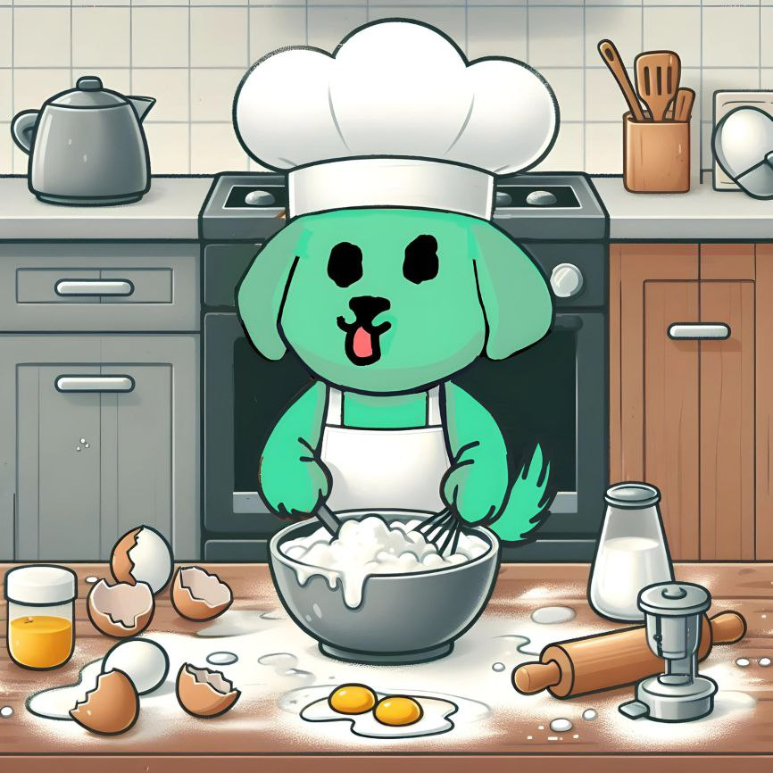

# 🥳 Meme.cooking

||| Buy a Token
<a href="/for-buyers/buy-a-token"><figure class="content-center"><figcaption class="caption"><em>Learn how to buy a meme without getting rugged</em></figcaption></figure></a>
||| Launch a Token
<a href="/for-cooks/create-a-token"><figure class="content-center"><figcaption class="caption"><em>Make a successful fair launch</em></figcaption></figure></a>
||| Learn More
<a href="/for-buyers/how-it-works"><figure class="content-center"><figcaption class="caption"><em>How we protect degens from snipers and ruggers</em></figcaption></figure></a>
|||
