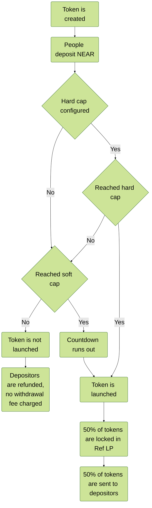

# 🎓 How It Works

*Not too complex, actually.*

When a token is created, a countdown is started. Anything between 5 minutes and 1 day can be configured. During that time, other people can deposit and withdraw NEAR to this meme token, if they want to buy it.

* If by the end of the countdown, the token has less NEAR deposited than the configured soft cap, all NEAR is refunded to participants, and the token is not launched. Depositors need to actively withdraw their NEAR on the accounts page.
* If it has more NEAR deposited than the configured soft cap, the token is launched.
* If a hard cap is configured and the meme token reaches this cap prior to the end of the countdown, the token will be launched immediately.
* If the token launches successfully the deposited NEAR (excl. protocol fee) and ~50% of total distributed supply is deposited on Ref Finance, the LP is locked for 69 years, and the other ~50% of tokens is distributed to depositors proportionally to their deposit. If you deposit twice as much NEAR, you get twice as much tokens. The total distributed supply depends on whether a team allocation has been set up, e.g. if there is a 30% team allocation then ~35% will go to the LP and the other ~35% will go to depositors.
* You can withdraw your NEAR before the countdown ends, but you will be penalized with 2% fee for doing so. This fee will be distributed to other people who have the NEAR deposited at the moment when the countdown ends, no matter if the token is launched or not.
* If the token reaches the necessary deposit amount of the configured soft cap, then they can claim their token on the accounts page. Tokens will not be distributed automatically.

### Examples

Example 1:

* Someone creates a meme token with 1-day countdown
* The token peaks at 69,000 NEAR total deposited
* The meme fell off, almost everyone has withdrawn everything, only 700 NEAR is left when the countdown ends
* The token is not launched, the last believers who didn't withdraw, are fully refunded (except for the 0.5% fee)

Example 2:

* Someone creates a meme token with 1-hour countdown
* Insiders snipe 25,000 NEAR worth of it
* \<insert your favorite CT influencer> calls it, pumping the deposit amount to 30,000 NEAR
* After the countdown ends, 100% of deposited NEAR and 50% of tokens are deposited and locked on Ref, and users claim their share of tokens at a market cap of 59,700 NEAR
* Insiders bought at the same price as everyone else, and if they dump right after the token launched, they will end up at a loss
